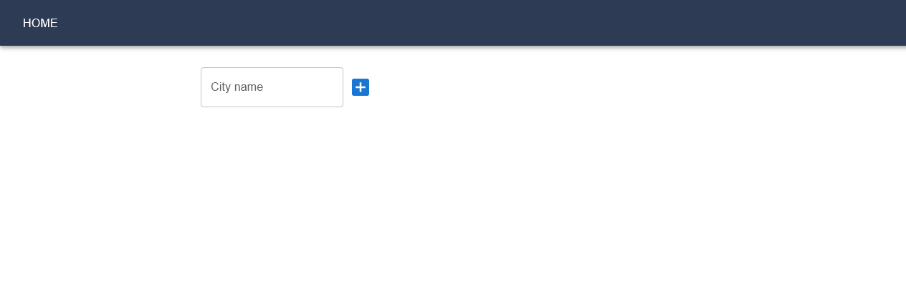

# Rinalin's Weather Forecast Application

## 1. Project Description

Rinalin's Weather Forecast application is a simple yet powerful tool built with React, allowing users to easily view
weather forecasts in any city. The app features a modern and intuitive interface, making it easy to find and view
the weather data you need. With a focus on providing accurate weather information, the app includes detailed data on
temperatures, humidity, wind speed, and more. All the data is presented in an easy-to-read format,
allowing you to quickly make decisions based on the weather conditions.

Besides React, I used next libraries , that I felt were a good fit for the project:

- Redux Toolkit for state management
- Material UI for visual part
- React-router-dom for navigation
- axios for server requests
- As a replacement for backend to store data externally I used browser Localstorage

### Challenges I met , while developing this app:

- I learned that you can subscribe to store changes and send them to local storage directly without using additional
  functions
- Discovered that city Llanfairpwllgwyngyllgogerychwyrndrobwllllantysiliogogogoch exists and how to handle such a large
  title in card.
- Found some pitfalls like , if you will open app.adress/#/london directly from your browser, it will work as intented
- Was difficult to not duplicate Thunks , but I managed to overcome it using flags initRequest = true/false

## 2. How to Install and Run the Project

After downloading source code, depending on package managers you're using you should:

1. Install packages, with Yarn : `yarn install` or simply `yarn`; with NPM : `npm install`
2. Start the project: `yarn start` , `npm start`
3. The project will be opened on localhost:3000

## 3. How to Use the Project

1. This is what starter page will look like:
   
2. Type some city name (e.g. London) into input field , and press 'Enter' or click on plus icon
3. The Weather Card with short info about London's weather will appear.
4. For detailed info you can click on card it will send you to another page.
5. To get back from detailed info use 'Home' button in Header.
6. Cities array will be saved in local storage, so on page reload you will get the same results.
